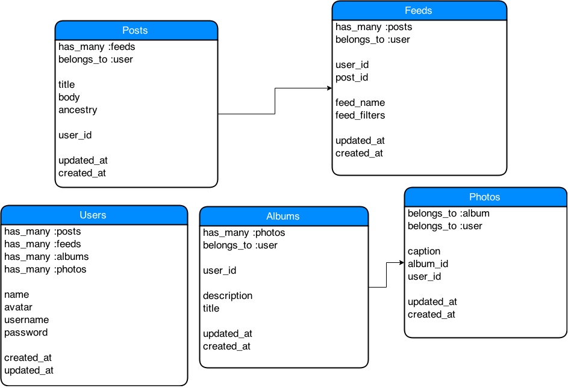

## Family Facebook

Personal project to create a private family chatting, messaging, photo-sharing application.

### To Do List:

####Features:
* Posts
* User authentication
** Devise
** Omniauth
* Custom feeds: user can create feeds based on different filters
* Photos (use paperclip or carrierwave)
** photo albums
** photo tagging
* File-uploading and sharing
* 

####Technical Features:
* Continuous Integration with tests (upon commit, runs all tests)
* 

### ERD (will continue to be updated)

